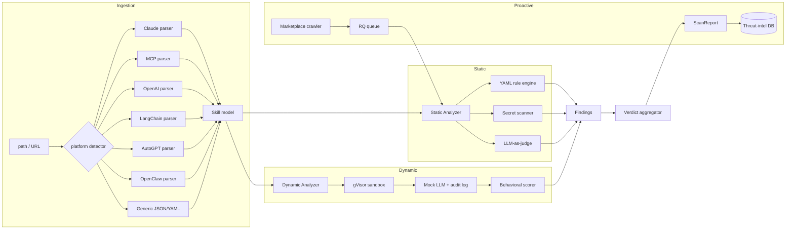

# clean-skill

**clean-skill** is an open-source scanner that detects malicious AI skills
hiding in skills marketplaces. Threat actors are embedding prompt injection,
data exfiltration payloads, and host-compromise logic inside AI agent
skills — the npm supply-chain problem, but for LLM agents. clean-skill scans
skills **before** they are installed or executed.

It is platform-agnostic: Claude / Anthropic SKILL.md, MCP servers, OpenAI GPT
Actions, LangChain tools, AutoGPT plugins, OpenClaw/ClawHub skills, and any
generic JSON/YAML tool manifest.

## Why another scanner?

| Tool                                   | Multi-platform | Crawler | Community rules | Dynamic sandbox | License |
|----------------------------------------|:--------------:|:-------:|:---------------:|:---------------:|---------|
| cisco-ai-defense/skill-scanner         | MCP only       | no      | yes             | no              | OSS     |
| NMitchem/SkillScan                     | single         | no      | limited         | yes             | OSS     |
| Mondoo                                 | no             | no      | no              | yes             | closed  |
| Bitdefender AI Skills Checker          | OpenClaw only  | no      | no              | no              | closed  |
| **clean-skill**                        | **all**        | **yes** | **yes**         | **yes**         | Apache-2 |

## Install

Requires Python 3.11+. Docker + gVisor (`runsc`) are required for dynamic
analysis; static analysis works without them.

```bash
git clone https://github.com/clean-skill/clean-skill && cd clean-skill
python -m venv .venv && source .venv/bin/activate
pip install -e ".[dev]"
cp .env.example .env.local    # fill in API keys for LLM-as-judge
```

Build the sandbox image (optional; only needed for `--dynamic`):

```bash
docker build -f docker/sandbox.Dockerfile -t cleanskill/sandbox:latest .
```

## Quickstart

```bash
# Static-only scan of a local skill directory
clean-skill scan --static-only tests/fixtures/skills/malicious_claude

# Full scan: static + dynamic sandbox
clean-skill scan tests/fixtures/skills/malicious_claude

# Scan a remote manifest URL
clean-skill scan https://example.com/some-skill/mcp.json

# Emit a machine-readable report
clean-skill scan --json tests/fixtures/skills/benign_claude > report.json

# List loaded detection rules
clean-skill rules list
```

Exit codes: `0` = clean, `1` = suspicious, `3` = malicious / block, `2` =
ingestion error. This makes clean-skill CI-friendly out of the box.

## Architecture



Detailed design in [`docs/ARCHITECTURE.md`](./docs/ARCHITECTURE.md).

## Detection rules

Rules are YAML files under `rules/`. They are Sigma-inspired and open to
community contribution — see [`docs/rule_format.md`](./docs/rule_format.md)
and [`CONTRIBUTING.md`](./CONTRIBUTING.md).

Starter rule pack:

| ID          | Category             | Severity | Signal                                         |
|-------------|----------------------|----------|------------------------------------------------|
| CS-PI-001   | instruction_override | high     | "ignore previous instructions" family          |
| CS-PI-002   | prompt_injection     | critical | Fake `<system>` role markup                    |
| CS-OB-001   | obfuscation          | high     | Base64 blobs decoding to shell / URL / ELF     |
| CS-EX-001   | exfiltration         | critical | webhook.site, requestbin, Slack/Discord hooks  |
| CS-CH-001   | credential_harvest   | critical | `.aws/credentials`, `id_rsa`, IMDS, env dumps  |

## Threat model

Documented in [`THREAT_MODEL.md`](./THREAT_MODEL.md). In short, clean-skill
addresses five attack classes: prompt injection, obfuscated payloads,
outbound exfiltration, credential / host-data theft, and sandbox escape via
tool abuse.

## Project status

v0.1 is an engineering preview. The static analyzer and CLI are stable enough
to run in CI. The crawler and threat-intel API are scaffolded but intended
for the first few external contributors to extend.

## License

Apache-2.0. See [`LICENSE`](./LICENSE).
